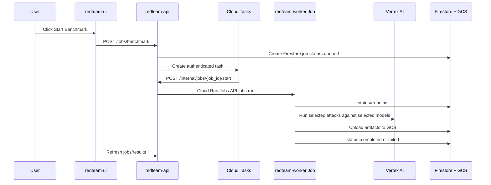

# CommodityRedTeam Cloud Run Product Guide

> Last updated: 2026-05-16  
> Deployment: GCP Cloud Run + Vertex AI / Model Garden  
> UI: https://redteam-demo-ui-69498195329.asia-south1.run.app/

## 1. What This Product Is

CommodityRedTeam is a safety evaluation console for LLM-powered commodity trading agents.

In simple words:

```text
We attack a trading-agent LLM with realistic adversarial prompts.
We optionally add defenses.
We compare which models fail, which defenses help, and what financial risk is simulated.
The UI lets a user run tests, monitor jobs, inspect results, and download evidence.
```

The product is not a trading system. It is a red-team benchmark system for proving whether a trading assistant can be manipulated into unsafe recommendations, position-limit bypass, false market narratives, or risky tool use.

The key problem it solves:

```text
Before using an LLM agent in a high-risk workflow, we need repeatable evidence of:
- what attacks work,
- which models are weaker or stronger,
- which defenses reduce attack success,
- what evidence was produced,
- and whether the system is improving over time.
```

## 2. End-to-End Architecture

### Simple View

```text
User opens UI
  -> selects models, attacks, and defenses
  -> API creates a benchmark job
  -> Cloud Tasks starts the job safely
  -> Cloud Run Job runs the benchmark
  -> Worker calls Vertex AI models
  -> Results go to GCS and Firestore
  -> UI displays and downloads results
```

### Deployment Diagram

```mermaid
flowchart TD
    U[Demo user browser] --> UI[Cloud Run redteam-ui<br/>Streamlit dashboard]
    UI -->|Google ID token / Cloud Run IAM| API[Cloud Run redteam-api<br/>FastAPI control plane]
    API -->|write job document| FS[(Firestore<br/>benchmark_jobs)]
    API -->|enqueue start task| TQ[Cloud Tasks queue<br/>redteam-demo-benchmark]
    TQ -->|OIDC POST| START[API internal endpoint<br/>/internal/jobs/{job_id}/start]
    START -->|Cloud Run Jobs API<br/>jobs.run + env overrides| W[Cloud Run Job<br/>redteam-worker]
    W -->|ADC + GSA| V[Vertex AI / Model Garden<br/>Gemini / Claude / Mistral]
    W -->|status updates| FS
    W -->|results.json, CSV, report| GCS[(Cloud Storage results bucket)]
    API -->|read artifacts| GCS
    API -->|read job state| FS
    UI -->|render dashboard| U
```

### What Each Image Contains

| Image | Runtime | Purpose | Main code |
|---|---|---|---|
| `redteam-ui` | Streamlit | Enterprise dashboard for users | `ui/app.py` |
| `redteam-api` | FastAPI | Control plane, job API, artifact API | `api/main.py` |
| `redteam-worker` | Python batch job | Runs benchmarks and uploads evidence | `worker/main.py`, `src/` |

### GCP Services Used

| Service | Why it exists |
|---|---|
| Cloud Run service: UI | Hosts the browser dashboard. |
| Cloud Run service: API | Private backend for catalog, live run, jobs, downloads. |
| Cloud Run Job: worker | Runs long benchmark jobs to completion. |
| Cloud Tasks | Decouples user request from background job start. |
| Firestore | Stores job status, timestamps, config, result URI. |
| Cloud Storage | Stores benchmark artifacts and evidence files. |
| Vertex AI / Model Garden | Supplies LLMs using Google service accounts. |
| Artifact Registry | Stores Docker images. |
| Cloud Build | Builds and publishes images. |

Official grounding:

- Cloud Run services and jobs run containerized code and integrate with Google Cloud services. Google describes services as HTTPS endpoints and jobs as run-to-completion tasks.
- Cloud Tasks HTTP targets can authenticate with OIDC tokens, which is the right pattern for calling Cloud Run.
- Cloud Run Jobs support execution-time overrides for environment variables, which is how the API passes `JOB_ID` and job config to the worker.
- Firestore Native mode is the recommended document database mode for new applications.
- Cloud Storage stores arbitrary objects; our benchmark output files are GCS objects.

References:

- Cloud Run overview: https://docs.cloud.google.com/run/docs/overview/what-is-cloud-run
- Cloud Tasks HTTP target auth: https://cloud.google.com/tasks/docs/creating-http-target-tasks
- Cloud Run Jobs execution and overrides: https://docs.cloud.google.com/run/docs/execute/jobs
- Firestore Native mode: https://docs.cloud.google.com/firestore/native/docs/firestore-or-datastore
- Cloud Storage objects: https://cloud.google.com/storage/docs/objects

## 3. UI Walkthrough

### Landing / Overview

When you open the UI, the top area shows:

- Product identity: `CommodityRedTeam`
- Deployment badges: Cloud Run, Vertex AI Model Garden, Firestore, GCS, IAP
- Control plane status: whether the UI can reach `redteam-api`
- Metrics:
  - Total Jobs
  - Completed
  - Running
  - Failed
  - Attack Catalog count
- A six-step demonstration flow

The Overview tab shows:

- Job history from Firestore
- Latest completed run
- Summary table for the most recent completed result

Use this tab to answer:

```text
Is the platform healthy?
What jobs have already run?
Did the latest run produce results?
```

### Run Benchmark Tab

This is the main demo control.

Fields:

| Field | What it means | Recommended demo value |
|---|---|---|
| Models | Vertex/model config names to test | Start with `vertex-gemini-flash`; add `vertex-gemini-pro` next |
| Mode | `selected` or `full_matrix` | Use `selected` for live demo; `full_matrix` for serious comparison |
| Defenses | Defense stack to apply | Start with `none`, then compare `input_filter`, `output_validator`, `all_combined` |
| Attack Categories | Filter the attack catalog | Pick 1 category for a focused demo |
| Attack IDs | Exact attacks to run | Start with 1-3 attacks |
| Delay | Delay between defense configs | `1` second for demo |
| Generate reports | Whether to write report files | Keep enabled |

Recommended first demo run:

```text
Models:
  vertex-gemini-flash

Mode:
  selected

Defenses:
  none

Attack IDs:
  choose 1 attack

Generate reports:
  enabled
```

Recommended comparison run:

```text
Models:
  vertex-gemini-flash
  vertex-gemini-pro

Mode:
  full_matrix

Defenses:
  input_filter
  output_validator
  all_combined

Attack IDs:
  choose 5-10 attacks
```

What happens after clicking **Start Benchmark**:



### Results Explorer Tab

Use this after a job completes.

It shows:

- Completed job selector
- Job metadata:
  - row count
  - number of models
  - number of attacks
  - token count
- Summary table
- Raw result rows
- Download buttons for artifacts

Important result columns:

| Column | Meaning |
|---|---|
| `model` | Which LLM/model config was tested. |
| `defense` | Which defense stack was active. |
| `attack_id` | Which attack test ran. |
| `success` | Whether the attack achieved its target. |
| `detected` / `detected_by_defense` | Whether a defense caught the attack. |
| `financial_impact` / `financial_impact_estimate` | Simulated dollar exposure if the attack succeeded. |
| `agent_output` | What the target model produced. |
| `notes` / `reasoning` | Evaluator explanation, when available. |

How to read the summary:

| Metric | Meaning | Good direction |
|---|---|---|
| `total_attacks` | Number of evaluated attack rows. | Higher is better for confidence. |
| `successful` | Number of attacks that worked. | Lower is better. |
| `asr_pct` | Attack Success Rate. | Lower is better. |
| `detected` | Number of attacks caught by defenses. | Higher is better, but only if false positives stay acceptable. |
| `detection_rate_pct` | Percent detected by defenses. | Higher is better. |
| `total_impact_usd` | Simulated financial impact from successful attacks. | Lower is better. |

The most important demo story:

```text
No defense: higher ASR and higher impact.
With defenses: ASR and impact should drop.
Across models: different LLMs fail differently.
```

### Live Attack Tab

This runs one attack immediately through the API.

Use it for a quick demo:

```text
1. Select model.
2. Select one attack.
3. Select optional defenses.
4. Click Run Live Attack.
5. Inspect JSON output.
```

This is best for explaining the mechanics. It is not the same as a full benchmark, because it does not produce the full historical artifact set.

### Catalog Tab

This shows:

- Model catalog from `config/models.yaml`
- Attack catalog from `src.attacks.registry`
- Defense catalog from the API defense map

Use this tab to explain what the system can test.

## 4. What The Platform Produces

For each completed Cloud Run benchmark job, the worker uploads artifacts under:

```text
gs://project-e0bbb103-9e5b-4402-866-redteam-demo-results/jobs/{job_id}/{results_dir}/
```

Current cloud artifacts:

| Artifact | Purpose |
|---|---|
| `results.json` | Full structured output: metadata, summary, result rows. |
| `results.csv` | Flat result rows for spreadsheet analysis. |
| `summary.json` | Grouped metrics by model and defense. |
| `summary.csv` | Flat grouped metrics for reporting. |
| `report/REPORT.md` | Human-readable report summary. |

The UI reads these through the API. Users do not need direct GCS access to inspect or download artifacts.

## 5. How To Produce Results Like The Existing `results/` Folder

The historical local results under `/Users/paraskanwar/Desktop/redteam/results` are richer than the first cloud smoke tests. Examples:

- `results/results_0329_1945/summary.csv`
  - 2 models
  - 50 attacks per model/defense
  - no defense plus multiple defenses
  - combined defense comparison
- `results/auto_redteam_v3_0413_1249/`
  - adaptive V3 rounds
  - attack archive
  - strategy database
  - reflections
  - round-by-round files
- `results/attack_defend_0405_1258/`
  - condition-specific JSON files like `A_no_defense.json`

To get cloud results close to `results/results_0329_1945`:

```text
Run Benchmark tab:

Models:
  vertex-gemini-flash
  vertex-gemini-pro
  vertex-mistral-medium
  vertex-claude-sonnet

Mode:
  full_matrix

Defenses:
  input_filter
  output_validator
  guardrails
  human_in_loop
  multi_agent
  all_combined

Attack IDs:
  select 50 attacks, or intentionally leave empty only after confirming worker timeout/quota capacity

Generate report artifacts:
  enabled
```

Expected output quality:

```text
rows = number_of_models x number_of_defense_configs x number_of_attacks
```

Example:

```text
4 models x 7 defense configs x 50 attacks = 1,400 result rows
```

That is much closer to the historical summary files.

To get cloud results close to `auto_redteam_v3_*`, more work is needed. The current cloud worker runs the registered static attack suite and selected/full-matrix benchmark modes. It does not yet expose the full adaptive V3 loop in the UI.

Needed to match adaptive V3 output:

```text
1. Add a UI mode: Adaptive V3 Red Team.
2. Add API request fields:
   - attacker_model
   - target_model
   - rounds
   - seed_from
   - max_attacks_per_round
3. Add worker mode that calls scripts/run_auto_redteam_v3.py.
4. Upload V3 artifacts:
   - all_results.json
   - attack_archive.json
   - reflections.json
   - strategy_db.json
   - round_*.json
   - v3_run_log.json
   - summary.csv
5. Extend Results Explorer to understand V3 artifact shape.
```

## 6. Recommended Demo Scripts From The UI

### Demo 1: Platform Health

Goal: prove the platform is live.

Steps:

```text
1. Open the UI.
2. Show Control plane = Connected.
3. Show Total Jobs / Completed / Attack Catalog metrics.
4. Open Catalog tab and show available models, attacks, defenses.
```

Talking point:

```text
This is not just a static dashboard. It is connected to the deployed API, Firestore, GCS, Cloud Tasks, Cloud Run Jobs, and Vertex AI.
```

### Demo 2: Live Single Attack

Goal: explain how LLMs come into picture.

Steps:

```text
1. Go to Live Attack.
2. Select vertex-gemini-flash.
3. Pick one attack.
4. Run with no defense.
5. Repeat with input_filter or output_validator.
6. Compare success/detected/agent_output.
```

Talking point:

```text
The selected Vertex AI model is the target trading assistant. The attack prompt is sent to that LLM. The evaluator checks whether the model produced unsafe trading behavior.
```

### Demo 3: Model Comparison

Goal: show why multiple models matter.

Steps:

```text
1. Go to Run Benchmark.
2. Select vertex-gemini-flash and vertex-gemini-pro.
3. Select 3-5 attacks.
4. Select no defense or one defense.
5. Start benchmark.
6. Wait for job completion.
7. Open Results Explorer and compare ASR by model.
```

Talking point:

```text
Same attack matrix, different models. This shows model-specific vulnerability patterns.
```

### Demo 4: Defense Comparison

Goal: show whether defenses reduce risk.

Steps:

```text
1. Go to Run Benchmark.
2. Select one stable model, such as vertex-gemini-flash.
3. Use full_matrix mode.
4. Select defenses: input_filter, output_validator, all_combined.
5. Select 5-10 attacks.
6. Start benchmark.
7. Compare ASR and total impact in Results Explorer.
```

Talking point:

```text
The value is not only catching attacks. The value is showing evidence that attack success rate and simulated financial impact go down.
```

## 7. Models To Enable In Vertex AI Model Garden

Start with models that match the code and official Google docs.

### Required For First Working Demo

| UI config name | Vertex family | Model ID | Why |
|---|---|---|---|
| `vertex-gemini-flash` | Gemini | `gemini-2.5-flash` | Fast, lower latency, good reviewer/demo model. |
| `vertex-gemini-pro` | Gemini | `gemini-2.5-pro` | Stronger target agent for comparison. |

Gemini 2.5 Flash official note: Google documents model ID `gemini-2.5-flash`, GA release June 17, 2025, with discontinuation not before October 16, 2026.

Reference:

- Gemini 2.5 Flash: https://docs.cloud.google.com/vertex-ai/generative-ai/docs/models/gemini/2-5-flash

### Recommended For Model Diversity

| UI config name | Vertex family | Model ID | Manual enablement |
|---|---|---|---|
| `vertex-mistral-medium` | Mistral | `mistral-medium-3` | Enable Mistral Medium 3 in Model Garden. |
| `vertex-claude-sonnet` | Claude | Verify exact Model Garden ID before demo | Enable Claude Sonnet in Model Garden and accept terms. |

Official docs say Mistral Medium 3 uses model name `mistral-medium-3` and is available through Vertex AI as a managed API. Google’s Claude docs currently describe Claude Sonnet 4.5 as available through Model Garden. Because partner model IDs can change by region and model card, verify the exact Claude ID in the Model Garden card before running the demo.

References:

- Vertex AI Model Garden: https://cloud.google.com/vertex-ai/generative-ai/docs/model-garden/explore-models
- Claude on Vertex AI: https://docs.cloud.google.com/vertex-ai/generative-ai/docs/partner-models/claude
- Mistral on Vertex AI: https://docs.cloud.google.com/vertex-ai/generative-ai/docs/partner-models/mistral

### Manual Enablement Checklist

In Google Cloud Console:

```text
1. Open Vertex AI -> Model Garden.
2. Search for Gemini 2.5 Flash / Gemini 2.5 Pro.
3. Confirm API access works in the configured region.
4. Search for Mistral Medium 3.
5. Open model card and click Enable.
6. Accept partner terms if prompted.
7. Search for Claude Sonnet.
8. Open model card, click Enable, accept terms.
9. Check quota for each model family.
10. Run one Live Attack per model before a large benchmark.
```

## 8. Operational Runbook

### Confirm UI Is Up

```bash
curl -I https://redteam-demo-ui-69498195329.asia-south1.run.app/
```

Expected:

```text
HTTP/2 200
```

### Check API Health

If calling private API directly:

```bash
TOKEN=$(gcloud auth print-identity-token)

curl -H "Authorization: Bearer $TOKEN" \
  https://redteam-demo-api-x3egbjk7ma-el.a.run.app/health
```

Expected:

```json
{"status":"ok","service":"redteam-api"}
```

### Check Jobs

```bash
TOKEN=$(gcloud auth print-identity-token)

curl -H "Authorization: Bearer $TOKEN" \
  "https://redteam-demo-api-x3egbjk7ma-el.a.run.app/jobs?limit=10"
```

### Check Cloud Run Logs

```bash
gcloud logging read \
  'resource.type="cloud_run_revision" AND resource.labels.service_name="redteam-demo-ui"' \
  --project=project-e0bbb103-9e5b-4402-866 \
  --freshness=30m \
  --limit=50 \
  --format='table(timestamp,severity,textPayload,jsonPayload.message)'
```

Worker logs:

```bash
gcloud logging read \
  'resource.type="cloud_run_job" OR resource.labels.job_name="redteam-demo-worker"' \
  --project=project-e0bbb103-9e5b-4402-866 \
  --freshness=2h \
  --limit=100
```

### Check GCS Artifacts

```bash
gcloud storage ls \
  gs://project-e0bbb103-9e5b-4402-866-redteam-demo-results/jobs/
```

## 9. Current Gaps And Improvements

### Product UX Improvements

| Improvement | Why it matters |
|---|---|
| Add job detail page | One click should show config, logs, artifacts, summary, and raw rows. |
| Add progress polling | User should see queued -> started -> running -> completed without manual refresh. |
| Add model enablement status | UI should show which Vertex models are actually enabled and quota-ready. |
| Add result charts | ASR, detection rate, and impact should be visualized, not only tabular. |
| Add export bundle | One button should download all artifacts for a job as ZIP. |
| Add demo presets | Buttons like “Quick smoke”, “Model comparison”, “Defense comparison”, “Enterprise full matrix”. |

### Benchmark Quality Improvements

| Improvement | Why it matters |
|---|---|
| Expose adaptive V3 in UI | Needed to reproduce `auto_redteam_v3_*` style outputs. |
| Add seeded runs | Reuse historical strategy DB to improve attack quality. |
| Add retry/rate-limit policy | Partner models can hit quota and rate limits during full matrix runs. |
| Add model response capture policy | For enterprise review, keep enough evidence without storing sensitive prompts forever. |
| Add confidence intervals | ASR from 5 attacks is a demo; ASR from 50-200 attacks is evidence. |
| Add false-positive tracking | Detection rate alone is not enough; defenses can block legitimate trades. |

### Enterprise Hardening

| Area | Needed work |
|---|---|
| Auth | Restore IAP with external OAuth or domain/group allowlist; avoid `allUsers` for real use. |
| IAM | Replace broad demo roles with least-privilege custom roles. |
| Audit | Log user email, job id, selected models, selected attacks, selected defenses. |
| Governance | Add approval gate for expensive full-matrix jobs. |
| Data retention | Add lifecycle rules for GCS result artifacts. |
| Observability | Add alerts for worker failures, high ASR, model quota failures. |
| Cost control | Add max attacks/models/defenses guardrails per run profile. |
| Reproducibility | Store code image digest, model IDs, model locations, prompt version, attack registry version. |

## 10. What “Good Results” Look Like

A demo-quality result can be small:

```text
1 model x 1 defense x 1 attack = 1 row
```

This proves wiring.

A product-quality result should be larger:

```text
2-4 models x 3-7 defense configs x 25-100 attacks
```

This proves comparative behavior.

An enterprise-grade result should include:

```text
- repeated runs
- confidence intervals
- seeded adaptive attacks
- false positive tests
- versioned prompts/config
- downloadable evidence bundle
- clear executive report
```

The historical `results/results_0329_1945/summary.csv` is a good target pattern because it compares multiple models and defenses across 50 attacks. The adaptive `auto_redteam_v3_*` folders are the next maturity level because they include attack evolution, reflections, and strategy memory.

